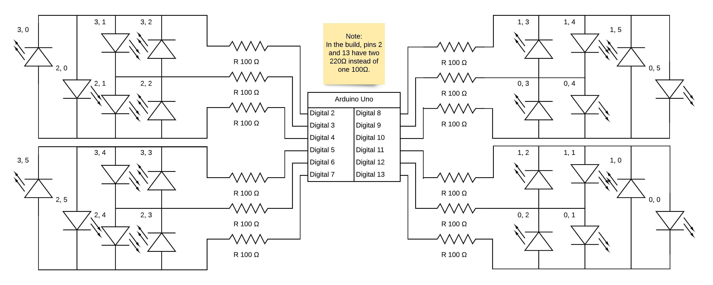

# 12-Step Led Clock
 
A clock consisting of 24 (+2) leds, the left column represents hours, one hour per step, while the right column represent minutes, 5 minutes per step.
The two white leds at the top represent AM/PM. AM left, PM right.
 
I realized after the project was initialized that the board only have 13 digital outputs and 6 analog ones, which is not enough to power all the 26 leds separately. 
Maybe there are some library or trickery one can do use, otherwise I will just develop the code and demonstrate it in two parts.

// Edits:
Had to charlieplex, 4 sets of 6 due to complexity and hardware limits, had to change layout from 2 cols of 12 to 4 of 6

 
[Code](./12-step-led-clock.ino)
 
[Video](./12-step-led-clock.mp4)
 
## Circuit Diagram
 
