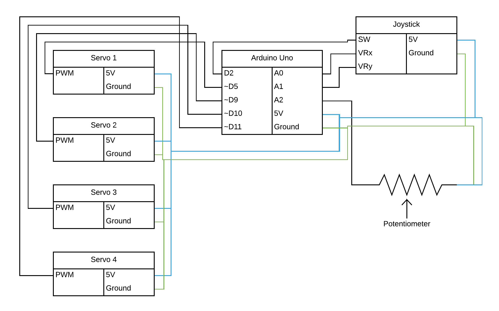
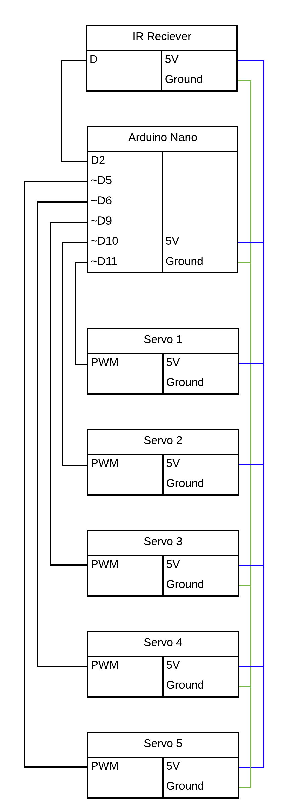

# arduino-arm

A small arm controlled by an Arduino board and servos.

## Controls

- Hand = ossa metacapri
- Fingers = ossa digitorum

| IR | Remote | Controls |
| :-: | :-: | :-: |
| Power | VOL+ | FUNC/STOP |
| Back | Play/Pause | Forward |
| Down | VOL- | UP |
| 0 - open fingers | EQ | ST/REPT |
| 1 - humerus up | 2 - radius up | 3 - hand up |
| 4 - humerus left | 5 close fingers | 6 - humerus right |
| 7 - humerus | 8 - radius down | 9 - hand down |

## 3D code

The printing code of this project is covered by [this](https://github.com/grdall/) repository.

[Code](./arduino-arm.ino)

[Video](./arduino-arm.mp4)

## Circuit Diagram

**IMPORTANT**: When using IR, make sure the receiver is wired correctly or else it will short circuit. See [IR Controller/7-Segment](./ir-controller-seven-segment/ir-controller-seven-segment.md) for more details and usage.

## Dependencies

- (IRremote 3.3.0)[https://github.com/Arduino-IRremote/Arduino-IRremote]
- (Servo 1.1.8)[https://www.arduino.cc/reference/en/libraries/servo/]