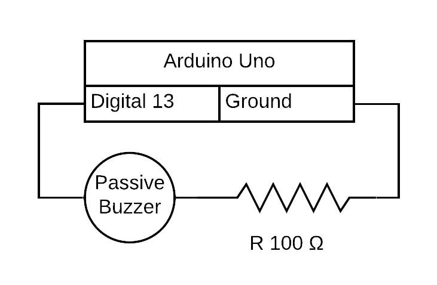

# Buzzer Music

A mix of songs or melodies that can be played on a passive buzzer.

Implemented a class ([melody.h](./melody.h)) which holds the melody information.
- String melodyName is the name of the melody or song.
- int melodyLength is the number of notes/beats in a melody. (would be easier to get this from int arrays, but can't infer as the arrays are pointers)
- int array notes that holds the values used by tone() function to make a certain tone. List of tones can be found in [tones.h](./tones.h).
- int array beats holds the length each tone should be played, where 1 is the shortest, and can be incremented as needed.
- int tempo is the speed the melody is played at, lower is faster.

Melodies, in order:
1. Twinkle Twinkle Little Star
1. Happy Birthday To You
1. Ja Vi Elsker Dette Landet (National Anthem of Norway)
1. Take On Me by Aha (National Anthem of Norway, international version)
1. All Star by Smash Mouth ([MP3-file](./audacity/all-star-mix.mp4))

No copyright infringement intended.

Since I only have one buzzer, melodies or songs with multiple notes played at the same time (ex. treble and bass, see All Star - Smash Mouth) must be played, recorded, and then synced in audio editing software. I noticed while combining the bass and treble for All Star that it didn't completely sync up though I should have added the notes and beats correctly.

- YouTube channel which has some easy to follow piano tutorials, used to make some of the melodies: https://www.youtube.com/channel/UCbaY6IEY0-pRHBU_qCswoNQ
- Base for melody class: https://www.arduino.cc/en/tutorial/melody
- Example I used to make a class: https://roboticsbackend.com/arduino-object-oriented-programming-oop/

[Code](./buzzer-music.ino)

[Video](./buzzer-music.mp4)

## Circuit Diagram

## Add a song

1. Find either the sheet music or a tutorial (Piano tutorials can be made in a program called [Synthesia](https://synthesiagame.com), which will display the keys and length to hold down each key if sheet music is too hard to read).
1. Note down all the notes played in order. Notes can be found in [notes.h](./notes.h) and are prefixed with "NOTE_", followed by the letter of the note ("A", "B", etc.) and finally the octave number. For black keys, only sharp keys work, which need an "S" after the letter, before the number. Zeros ("0") can be used if there is a break where no notes should be played.
1. Write down the length each note should be held, use 1 for the shortest notes, then 2 for the second shortest, etc. Finish with a zero to mark the end of the beats array so the system can count the number of beats. 
1. By this step you should have one long list of references to note integer values, and one list of beats (how long the note is played for). These lists should be equally long EXCEPT the zero you added to the end of the beats list. Make these lists into int arrays (ex. `int notes[] = { NOTE_C4, NOTE_CS4, NOTE_D4 }` and `int beats[] = { 1, 2, 3, 0 };`).
1. Add the tempo (depends on the beats, tempo is likely to be somewhere between 100 and 300) and song name.
1. Finally use the function `play(Melody m)` function to play the song in either setup or loop. 

## Play though USB

Most songs, despite only being simple beats, will be too long for the song to be store on the Arduino board.
A workaround for this is to feed notes and beats though USB from a computer which can be done with over the serial port used to upload the .INO-file to the board in the first place. In theory, any programing language should eb able to do this, but this project uses Python as it has a simple third party package for this, called [pySerial](https://pyserial.readthedocs.io/en/latest/shortintro.html).
The file called `play.py` includes the code run from a terminal on the host computer, with some simple utility functions, like a short help command, listing the .H-files which contains the songs, used for the native Arduino version, a "translator" which reads these .H-files into a format Python can use (not store anywhere, just in memory).
Python will then parse part of a song, send a string containing tempo, four notes and four beats at a time, wait and repeat. The card will listen over the serial port, process and play the notes it was given in the string.

To play though USB, assuming Python is installed:
1. Clear the `loop()` function in [buzzer-music.ino](./buzzer-music.ino)
1. Upload the program to an Arduino with the same layout as in [Circuit Diagram](#Circuit-Diagram)
    - NB: leave the USB cable plugged in!
1. Open a CLI in this folder
1. $ `python play.py 1`

## TODO

- Optional: implement functionality to play either from serial or .h (status quo)
- Arduino program unexpectedly not working as before with play() function, used to be tempo / 2, is no more natural with tempo * 4 or 5, even with same .H-files
- Timing issue in play.py, waiting less than 5 seconds between each note results in pauses and loss of tempo. Anything less causes segments to overlap.
  - Old code may be useful, add tempo to it?
                for b in dataBeats:
                    sleepFor += int(b)
                
                # time.sleep(float(sleepFor) / 1000)
                