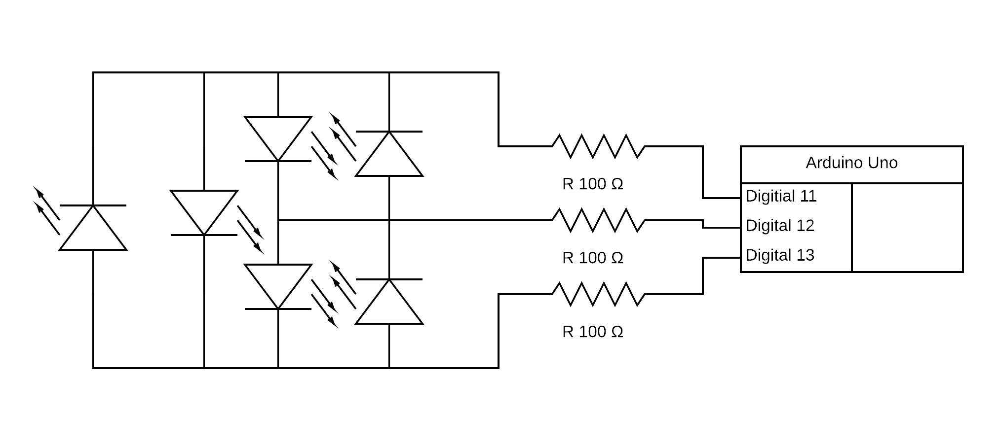

# Charlieplexing Leds

A separate project for charlieplexing leds. This is a group of 6 leds controlled by 3 pins, but it can be expanded: and pins charlieplexing can control n^2 - n leds.

I found [this YouTube video](https://youtu.be/Bx5GLyJSWPk) helpful.

[Code](./charlieplexing-leds.ino)

[Video](./charlieplexing-leds.mp4)

## Circuit Diagram

