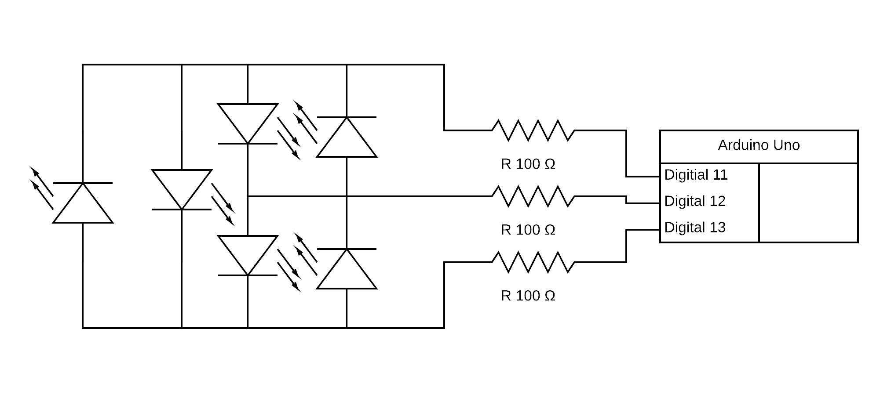

# Charlieplexing Six Leds

A separate project for charlieplexing a set of six leds. This is a group of 6 leds controlled by 3 pins, but it can be expanded: and pins charlieplexing can control n^2 - n leds.

I found [this YouTube video](https://youtu.be/Bx5GLyJSWPk) helpful.

[Code](./charlieplexing-six-leds.ino)

[Video](./charlieplexing-six-leds.mp4)

## Circuit Diagram

## Led Grid

| Y\X | 0, Y | 1, Y |
| --- | --- | --- |
| X, 2 | 0, 2 | 1, 2 |
| X, 1 | 0, 1 | 1, 1 |
| X, 0 | 0, 0 | 1, 0 |