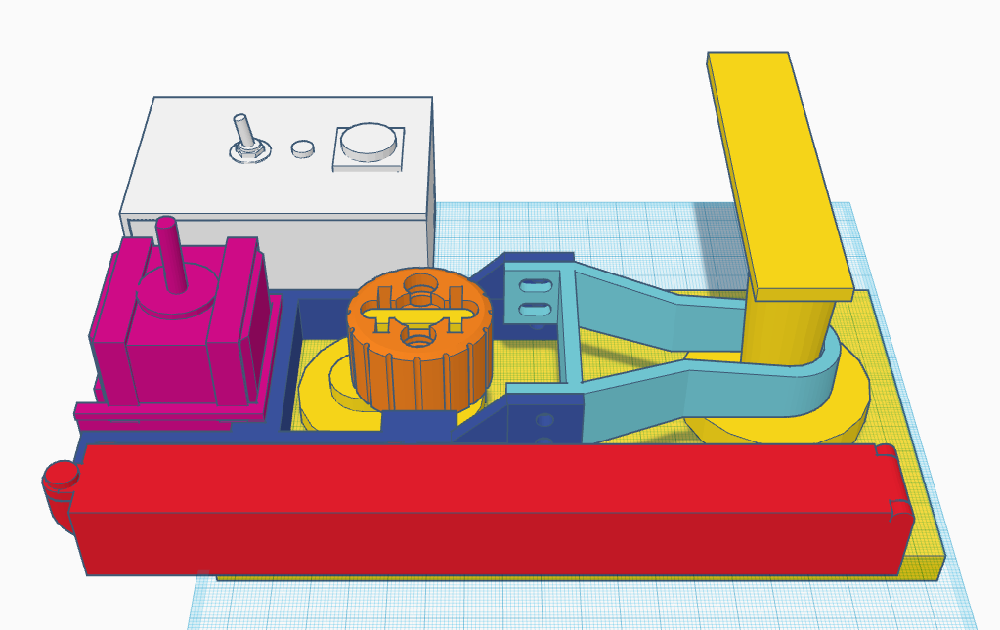

# Dumb door

Like a smart door, but dumb. Does not require invasive installation. 
Related to [3D printed dumb door project](https://github.com/gardehal/3d-printing/tree/main/created/dumb-door).

> [!NOTE]  
> Work in progress

## TODO

- Authentication (e.g. key on pico, auth API on home server)
  - Log who made the call when over network, button = "[button press]"
- Charts and final documentation.
- logging potential issue reading/writing to file across threads still (specifically during startup, OS code ?? and/or similar ENOENT error)
- final adjustments for stepper steps to lock/unlock door and some way to calibrate (e.g. move lock to one extreme or other)
  - Number of steps to take as argument for network call?

## Circuit Diagram

## Part list

- 2x 18650 Lithium-Ion rechargeable batteries (with tip)
- 1x NEMA-17 sized stepper motor (and cables if not included)
- 1x stepper motor driver
- 1x Raspberry Pi Pico W
- 1x on/off switch
- 1x button (optional)
- 1x multicolour LED + 3x 220 Ohm resistors (all optional)
- 1x half-size breadboard (optional)
- 2x zip ties 3mm x 1mm x 80mm+
- 3x M4 x 12mm bolts/screws + nuts
- 4x M5 x 12mm bolts/screws + nuts (2x is fine)
- 1x push spring (7.5mm x 13mm), cut in half
- 1x LD1117 3.3V voltage regulator
- 1x Schottky diode (optional)

## Setup guide

NB: The first part of this relates to 3D printed parts over at [this repo](https://github.com/gardehal/3d-printing/tree/main/created/dumb-door)

1. Load frame-upper and frame-lower into a CAD with a rough 1:1 drawing of your handle and lock and check the following:
    - frame-upper handle shape and size
    - frame-lower fit with locking mechanism, height and width wise
    - lock-adapter fits your locking mechanism
    - lock gear and motor gears fit and get a good grip
1. Print the following parts (optional order, but recommended so you can multitask with steps 3+):
    - 1x frame-upper
    - 1x frame-lower
    - 1x lock-adapter
    - 1x battery-case
    - 1x brain-lid
    - 1x lock-gear
    - 1x motor-gear
    - 1x motor-case
    - 2x motor-case-clip
    - 1x brain-case
    - 1x battery-lid
    - 2x lock-gear-pin
1. Check that these parts physically fit and can be assembled with your setup:
    - frame-upper can be put over your handle and sits reasonably well when assembled as shown in the graphics
    - frame-lower can be attached to frame-upper and is flat towards the door
    - lock-adapter can be attached to the locking mechanism without any other movement than rotating with the lock
1. Adjust frames or gears as appropriate
1. Assemble the parts:
    - battery-case - using springs and wires to connect the batteries in series. Insert a M4 nut into the case, snap the lid into place and secure with a M4 bolt
    - brain-lid - attach LED, on/off switch, open/lock button, assemble breadboard with parts as shown in the graphics, wire everything up. Insert a M4 nut into the case, snap the lid into place and secure with a M4 bolt
    - motor-case - place the motor in the case and secure it with the clips, then slot a M4 nut into the motor-gear and screw it tightly onto the motor drive
    - lock-gear - inset lock-gear-pins (short clip side) into the lock-gear
    - frame-lower - snap the battery-case, brain-case, motor-case into the frame-lower as shown in assembly diagrams
1. Attach lock-adapter to the lock, using zip ties
1. Place frame-upper on the door handle, shim the frame-lower into place from below the lock-adapter, such that the inner "ears" of the frame is placed behind the lock-adapter. Use 2-4 M5 bolts and nuts to secure frame-upper to frame-lower
- solid core wires

## Assembly

- frame-upper (light blue)
- frame-lower (dark blue), note the "ears" aligned with the lock

- lock-adapter (orange)
- brain-case (white), including brain-lid, button, LED, on/off switch
- motor-case (hot pink), including motor and 2 motor-case-clips
- battery-case (red), including battery-lid

- lock-gear (dark green)
- lock-gear-pins (light green)
- motor-gear (light pink)

## Useful links

- PICO with VS Code IDE - https://youtu.be/O6lkYTfcMEg
- Basic PICO W internet connection - https://www.tomshardware.com/how-to/connect-raspberry-pi-pico-w-to-the-internet
- MicroPython async - https://www.youtube.com/watch?v=5VLvmA__2v0
- PICO sheet - https://datasheets.raspberrypi.com/picow/pico-w-datasheet.pdf
- PICO server - https://www.raspberrypi.com/news/how-to-run-a-webserver-on-raspberry-pi-pico-w/

## VS Code IDE

- Extensions:
    - MicroPico (formerly name Pico-W-Go and Pico-Go)
- Workflow:
    - Connect PICO with Data USB cable
    - Right click file > Run current file on Pico
    - Test functionality
    - Ctrl+C, X + Enter (abort current program)
    - Ctrl+Shift+P + "MicroPython: Reset > Soft" (soft reset machine)

## Retrospect

#### Good

- Ball hinges work well and if printed in the correct orientation (brain-case) they work great, otherwise the hinges may fall off if pushed too much (battery-case). Easy to add to parts and print compared to machining-inspired cylindrical hinges.
- Modular design and use of brackets (e.g. battery-case-standalone-bracket) to build a frame worked very well, parts can be switched out without having to print the entire 10+ hour suite of components + frame(s). The balls and receptacles could have a lower tolerances, balls are 4.5mm and receptacles are 5mm, with a 0.5 spacing between bracket and case on either side. Balls could probably be 4.75mm and spacing between bracket and case be closer to 0.1-0.25mm. Note that these frames/brackets should be printed vertically for the flexibility.
- Incorporated other parts like nuts/bolts/switch/buttons which are useful for areas where printed parts are too weak or to difficult to make.
- Potentially usable in a real setting (assuming someone can maintain software for security updates etc.)
- Printed pins (lock-gear-pin) worked well, where similar attempts at pins have been lackluster.
- Fun project, developed useful knowledge and concepts for later use.

#### Bad

- Going into this I had limited knowledge of some of the electronics in real world cases which caused a lot of delays and some expensive mistakes. However,  this was a good learning experience.
- Initial design was bad and relied on impossible physics, did not think it through.
- The brain-case module could've been better designed, the face plate with components should be removable for easier access to sensors on the face of the case (e.g. make face and bottom a single piece). Making it a little flatter and wider it could include a battery and make for an OK remote controller while still including the half-sized breadboard. Alternatively longer and thinner with a micro breadboard.
- NEMA 17 is rated for 12V, currently runs on 8.4V (2x 18650 batteries). Ideally a third one should be added to bump up voltage to 11.1 but it seems to be OK. This could and should have been predicated and incorporated from the start, since redesigns will include changes to the frame which currently is not worth the cost-benefit.