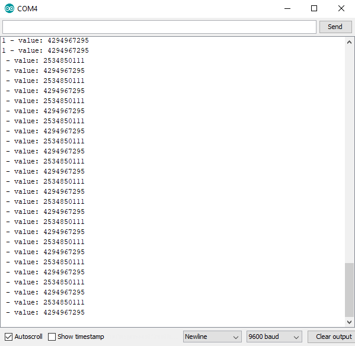
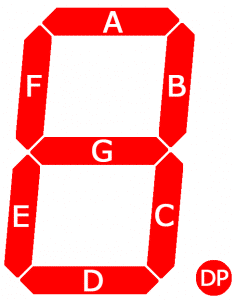
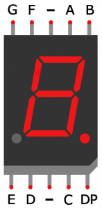
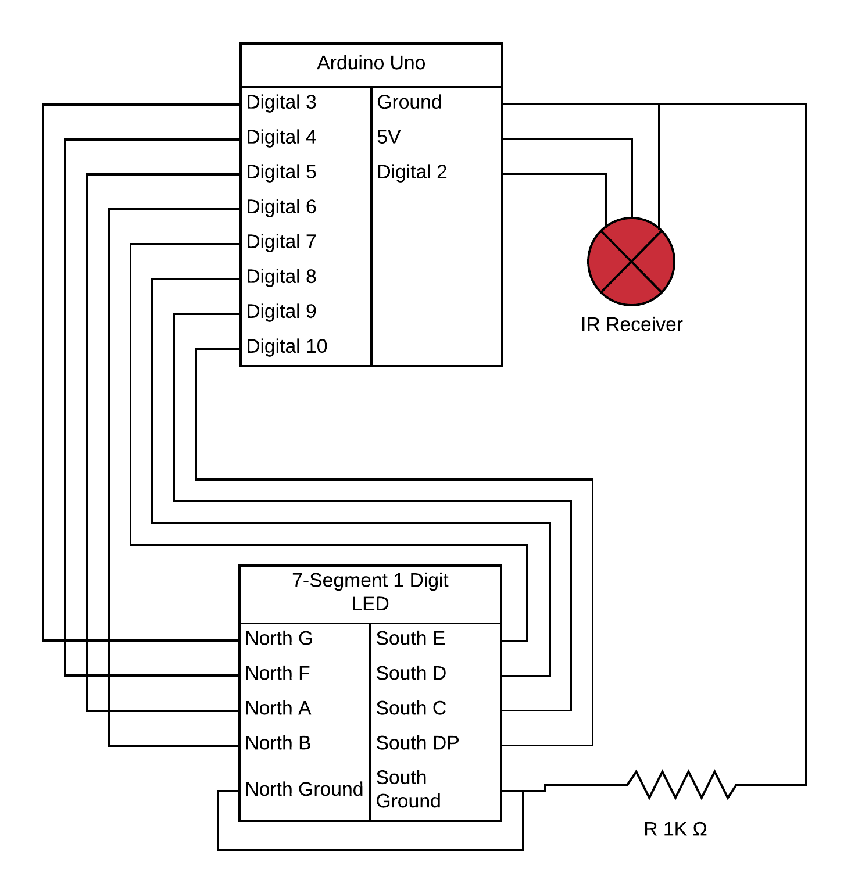

# IR Controller/7-Segment Display
 
Some basics on how the IR receiver is set up can how it can be controlled with the remote, as well as basics of a single digit 7-Segment LED display. 
Display shows 0-9, letters ABCEFGHIJLOPSU, "-", and ".". Use number keys to display numbers, up and down arrows to increment and decrement numbers, VOL+ to show decimal point ("."), VOL- to display minus/dash, Play/Pause button to show all symbols included, and Power to turn display off.
 
Without any modifications IR controller/receiver it seems to have:
- a 5 meter range, but the signals cannot be interpreted (IR Receiver will blink when receiving a signal)
- a 2 meter range where it can switch a LED on or off
- a 1 meter range where the Serial.print will print the correct key label and value (outside this range the correct key will not be written, but the value iss, and an additionally value is written, see the picture below, all key presses are the key "1", but after the second "1" the controller was out of the 1 meter range)
- signal does not go through a wooden table, about 2 cm thick
- signal dies not go through my hand if the controller is pressed into the skin
- signal goes presumably around my hand when the controller is < 0.5 cm away. It's also worth noting that this does not give the right signal and does not turn the LED on, like if the controller is too far away
- computer screen and phone both brock the signal completely
- signal needs a direct line of sight to the receiver to toggle the LEDs
- using aluminum foil as a reflector or parabola behind the receiver can extend the signal but only slightly
 
For best result, have a direct line of sight from controller to the receiver, 1 meter or less.
 

 
[Code](./ir-controller-seven-segment.ino)
 
[Video](./ir-controller-seven-segment.mp4)
 
## 7-Segment Layout
 

 
[Source (circuitbasics.com)](https://www.circuitbasics.com/arduino-7-segment-display-tutorial/)
 
## Circuit Diagram
 

## Dependencies

- IRremote 3.3.0