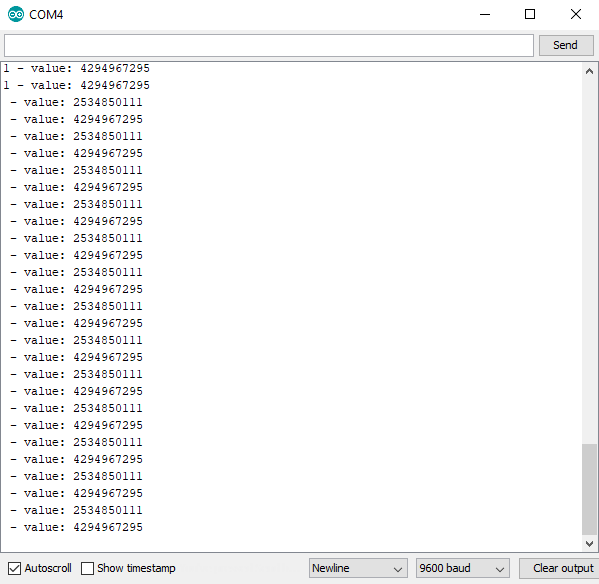
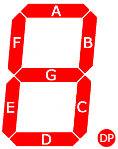
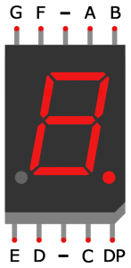
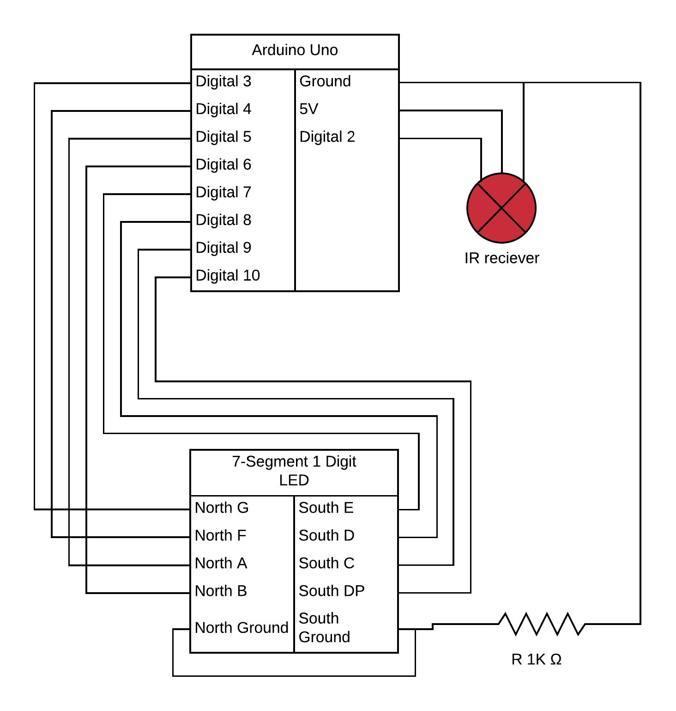

# IR Controller

Some basics on how the IR reciever is set up can how it can be controlled with the remote, as well as basics of a simgle digit 7-Segment LED display. 
Display shows 0-9, letters ABCEFGHIJLOPSU, "-", and "." Use number keys to display numbers, up and down arrows to increment and decriment numbers, VOL+ to show decimal point ("."), VOL- to display minus/dash, Play/Pause button to show all symbols included, and Power to turn display off.

Without any modifications it seems to have:
- a 5 meter range, but the signals cannot be interperated (IR Reciever will blink when recieving a signal)
- a 2 meter range where it can swithc a LED on or off
- a 1 meter range where the Serial.print will print the correct key label and value (outside this range the korrect key will not be written, but the value iss, and an additionally value is written, see the picture below, all key presses are the key "1", but after the second "1" the controller was out of the 1 meter range).
- signal does not go though a wododen table, about 2 cm thick
- signal dies not go though my hand if the controller is pressed into the skin
- signal goes persumably around my hand when the controller is < 0.5 cm away. It's also worth noting that this does not give the right singal and does not turn the LED on, like if the controller is too far away.
- computer screen and phone both brock the signal completely
- singal needs a direct line of sight to the reciever to toggle the LEDs
- using alumium foil as a reflector or parabol behind the reciever can extend the signal but only slightly

For best result, have a direct line of sight from controller to the reciever, 1 meter or less.

[Code](./ir-controller.ino)

[Video](./ir-controller.mp4)

## 7-Segment Layout

[Source (circuitbasics.com)](https://www.circuitbasics.com/arduino-7-segment-display-tutorial/)

## Circuit Diagram

