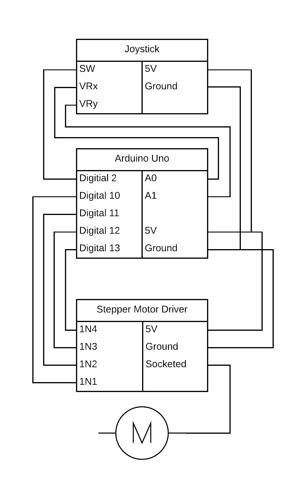

# Joystick Stepper Motor

Using a joystick to control a stepper motor.

Due to lack of F to M dupont wires the build got a little messy.

[Code](./joystick-stepper-motor.ino)

[Video](./joystick-stepper-motor.mp4)

## Circuit Diagram

