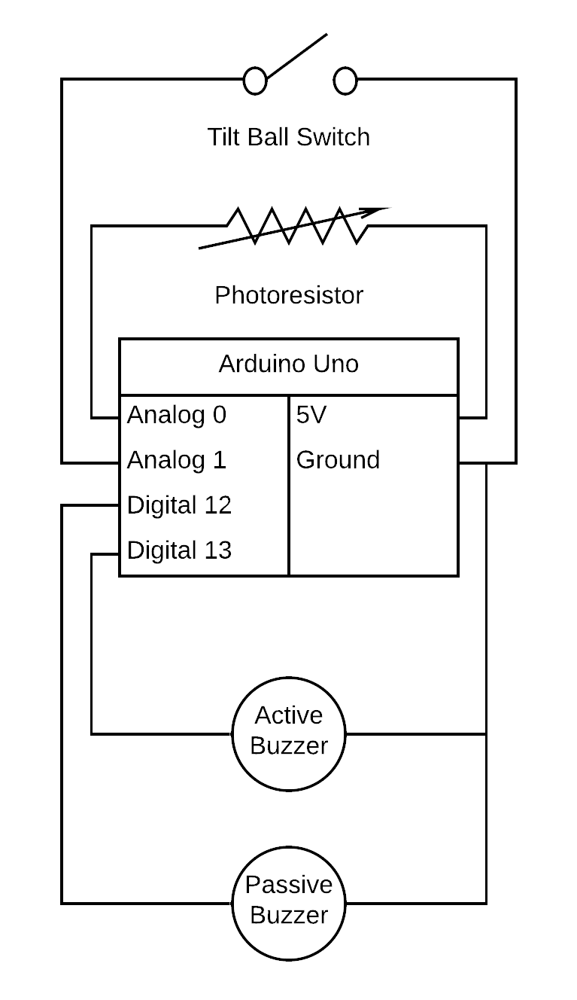

# Morning Alarm
 
An alarm that can be used to wake one up in the morning. This is a project focused on the tilt ball switch, photoresistor, active and passive buzzer. It is not meant to be very accurate, but rather to deploy modules in a real life situation. One could convert this to a working alarm, but it is suggested to include a real time clock or some other way to synchronize the projects internal variables to accurate real time.

The combination of light and movement surely is the best way to wake someone up.
 
[Code](./morning-alarm.ino)
 
[Video](./morning-alarm.mp4)
 
## Circuit Diagram
 
