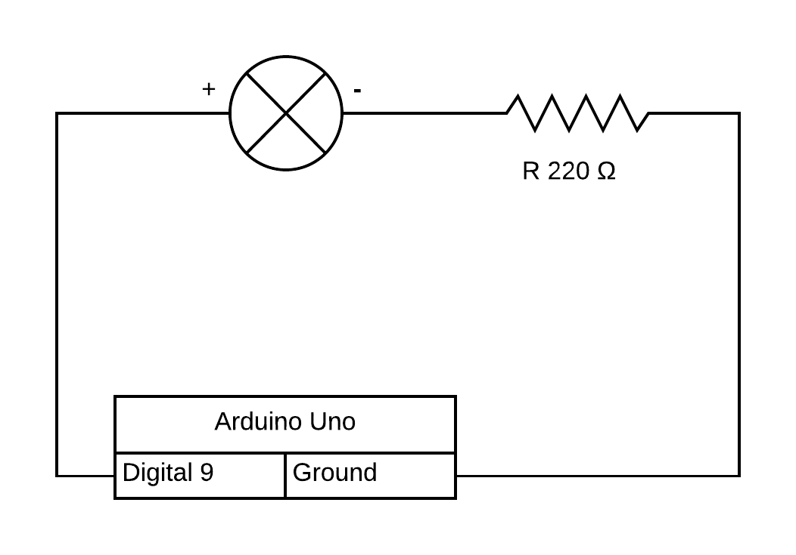

# Simple LED Oscillator

A simple program for slowly brightening a LED light, the quickly dimming it again, based on a stock sketch that dims a LED based on input from a potentiometer (AnalogInOutSerial).

[Code](./simple-led-oscillator.ino)

[Video](./simple-led-oscillator.mp4)

## Circuit Diagram

