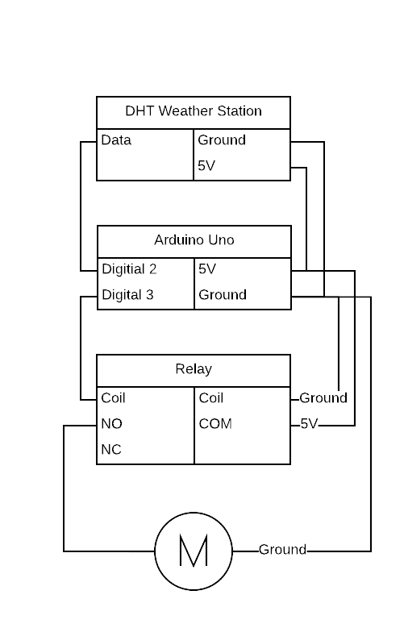

# Thermometer Activated Fan

A fan that is activated when a certain temperature and/or level of humidity is registered.

[Code](./thermometer-activated-fan.ino)

[Video](./thermometer-activated-fan.mp4)

## Circuit Diagram

