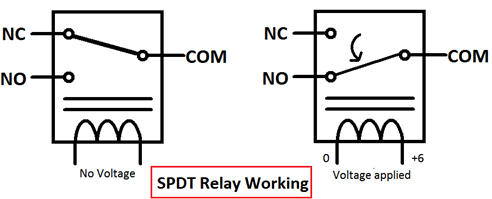

# Thermometer Activated Fan
 
A fan that is activated when a certain temperature and/or level of humidity is registered.
 
I found that the DHT11 is unreliable, usually returning 14 or 28 (+/- 2), though it's likely not more than 25 degrees in the room at most. 
For this reason I added a for loop to get an average of temperatures but it seems the inconsistency is from the sensor itself, not the wiring within the sensor or in the circuit. 
I thought I noticed the sensor returned 14 whenever the fan turned on due to the fan cooling the sensor, but the drop is too much to be from the fan, as well as the fact that the fan does not point at the sensor suggests it's something else. It could be that the surge og power sent to the fan could be altering the signals sent to the Arduino board.
 
In the video you may see the piece of string I used to keep the relay on the M to F Duponts, as it slid of with ease and I had no other way to reliably interfacing with it as it does not fit on the breadboard. I also used a spare wire to keep it from moving too much away from the breadboard. The thermometer above the bread board shows a little more reliable temperature, which always was over 25 C, which should result in the fan always being on. However, as you can see in the video, it toggles on and off. This is because of the aforementioned issue with the temperature dropping to 13/14 C, which appears to be due to the power drawn from the fan.
 
[Code](./thermometer-activated-fan.ino)
 
[Video](./thermometer-activated-fan.mp4)
 
## Circuit Diagram
 

 [Source](https://circuitdigest.com/article/relay-working-types-operation-applications)