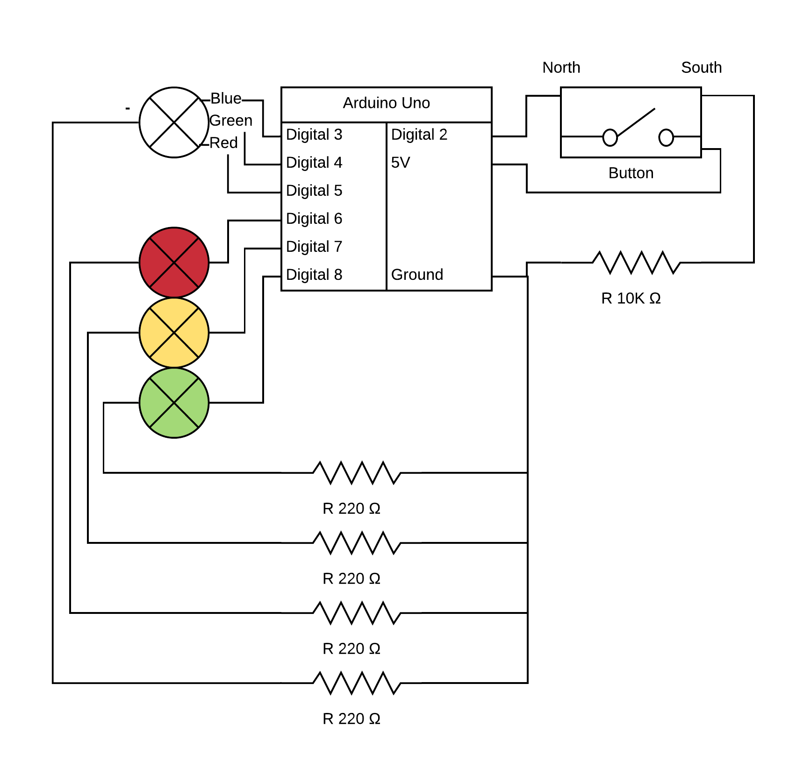

# Traffic Lights
 
A program for simulating a traffic and pedestrian lights. The green, yellow, and red LEDs are for traffic, the RGB LED is for pedestrians.
This version is a "Pedestrian Crossing", after the implementation of the button that halts traffic.
To convert it back to a "Intersection" version, simply disable the code that attaches the interrupt at line 23.
Here is a [BBC article](https://www.bbc.com/news/magazine-23869955) on the functionality of the button.
 
[Code](./traffic-lights.ino)
 
[Video](./traffic-lights.mp4)
 
## Circuit Diagram
 
