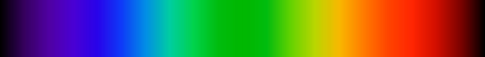
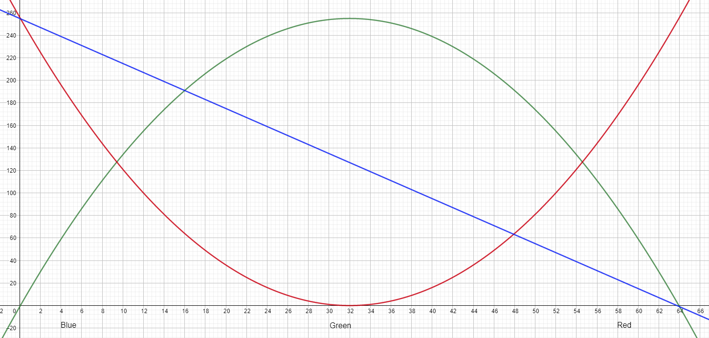

# Ultrasonic Led
 
A project for experimenting with the ultrasonic proximity sensor. The sensor changes the colour of a RGB led based on proximity. 
 
Max distance appears to be 35 centimeters, however at day two I got accurate readings of 64 cm. The third day I got 1.5 meters. I assume it depends on variables like reflection values of the surface and angles.
I tried to emulate the visible spectrum, pictured below, where the longer away something is from the sensor, the bluer the light, and when close the redder.
This didn't turn out completely as expected, as I am missing some colours like orange, as well as cyan being overrepresented. 
 

 
I conceived some graphs to represent the spectrum, using a convex curve to represent red light, concave curve to represent green, and a linear graph to represent blue. This is because red is present at each end of the spectrum but not so much in the middle, green is most commonly found found in the middle, and blue is mostly present in the blue end of the spectrum. I tried to use a concave curve, half the width of the others, but for some reason it would set the correct values thought the equation was correct ( abs((-1 * ((x - 16) * (x - 16))) + 255) ).
 
The equations for the curves are:
- Red: 0.25 * ((x - 32) * (x - 32))
- Green: (-0.25 * ((x - 32) * (x - 32))) + 255
- Blue: (x * -4) + 255
 
Which when combined as graphs looks like this. Each line represent their respective colour, and the text at the bottom is what primary colour on the spectrum.
 

 
[Code](./ultrasonic-led.ino)
 
[Video](./ultrasonic-led.mp4)
 
## Circuit Diagram
 
