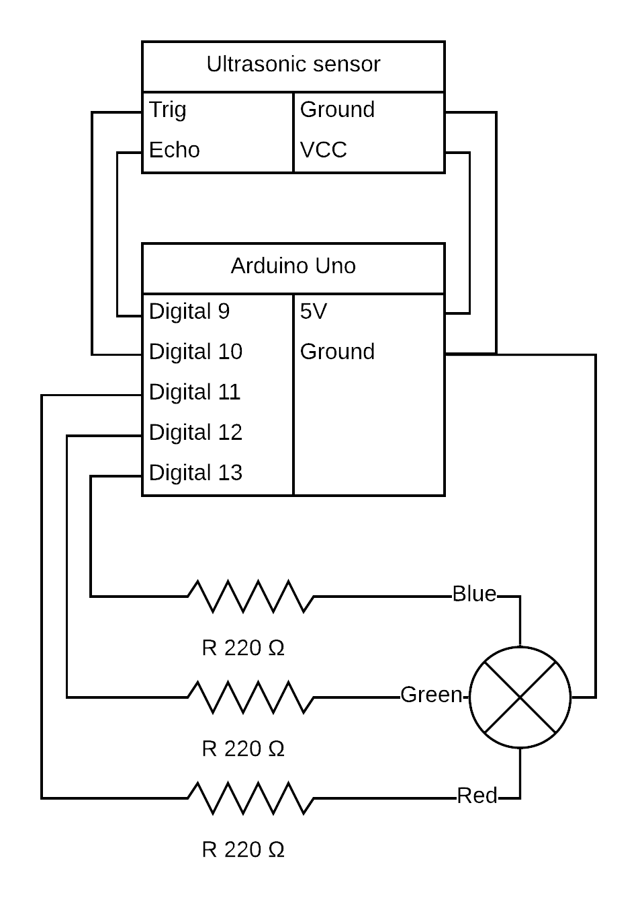

# Ultrasonic Led

A project for experimenting with the ultrasonic proximity sensor. The sensor changes the colour of a RGB led based on proximity. 

Max distance appears to be 35 centimeters.

[Code](./ultrasonic-led.ino)

[Video](./ultrasonic-led.mp4)

## Circuit Diagram

